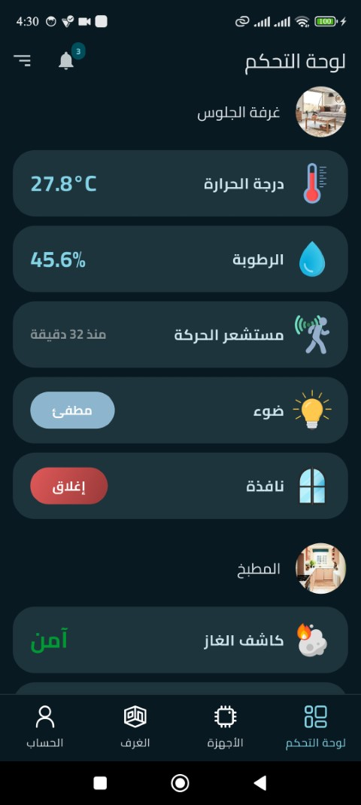
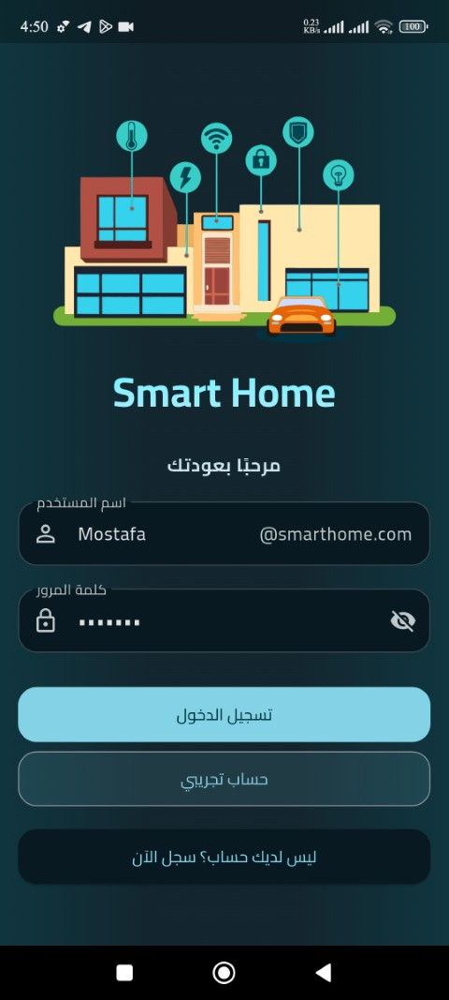
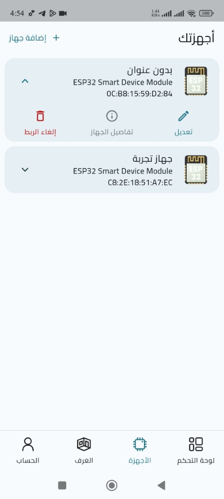
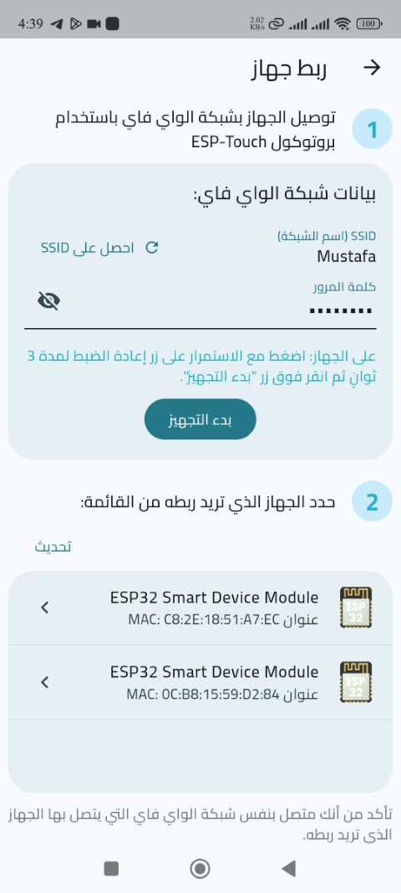
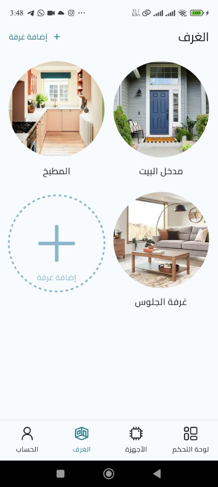

# 📱 Smart Home Control System

A mobile application built with **Flutter** as part of my graduation project at the **Faculty of Informatics Engineering, University of Aleppo**.  
The system allows users to **monitor sensors, control actuators, and manage multiple smart devices** connected via **ESP32 microcontrollers**, with a backend powered by **Supabase**.

---

## 🚀 Features

- **Authentication** – Create an account, sign in, or explore via a demo account.
- **Dashboard** – View all linked devices and components with real-time sensor readings and actuator controls.
    - Customize dashboard layout (list/grid).
    - Group components by device or room.
- **Component Details** –
    - Latest readings.
    - Sensor history with charts.
    - Rename components and assign icons.
    - View associated room and device info.
- **Device Management** –
    - Link ESP32 devices via **SmartConfig**.
    - View MAC address, linking date, and component list.
    - Rename or remove devices.
- **Rooms** – Create rooms with names and images, assign components to organize the smart home.
- **User Profile** – Customize username, profile picture, and update password.
- **Localization** – Full **English & Arabic** support with toggle option.
- **Push Notifications** – Receive alerts via **Firebase Cloud Messaging (FCM)**.
- **State Management** – Built with **Riverpod** and **Repository Pattern** for clean and scalable architecture.
- **Brightness Mode** – Support for both light and dark mode.

---

## 🛠️ Tech Stack

- **Frontend (Mobile):** Flutter, Dart
- **Backend:** Supabase
- **Hardware:** ESP32 microcontrollers (sensors & actuators)
- **State Management:** Riverpod + Repository Pattern
- **Notifications:** Firebase Cloud Messaging (FCM)

---

## 📂 Project Structure (simplified)

```
lib/
 ├── core/
 │   ├── constants/
 │   ├── l10n/
 │   ├── navigation/
 │   ├── providers/
 │   ├── theme/
 │   ├── utils/
 │   └── widgets/
 ├── features/
 │   ├── auth/
 │   ├── dashboard/
 │   ├── devices/
 │   ├── fingerprint/
 │   ├── images/
 │   ├── notifiecations/
 │   ├── profile/
 │   └── rooms/
 └── main.dart
```

---

## ⚙️ Installation & Setup

```bash
# Clone the repository
git clone https://github.com/OmarTarakji/smart_home_app.git

# Navigate into the project
cd smart_home_app

# Install dependencies
flutter pub get

# Run the app
flutter run
```

---

## 🖼️ Screenshots

- 
- 
- 
- 
- 
- 
- 
- 
- 
- 
- 
- 

---

## 📬 Contact

👤 **Omar Tarakji**
- Email: o.tarakji2001@gmail.com
- LinkedIn: https://www.linkedin.com/in/omar-tarakji/

---

✨ *This project showcases my skills in mobile development, IoT integration, and scalable app architecture.*  
